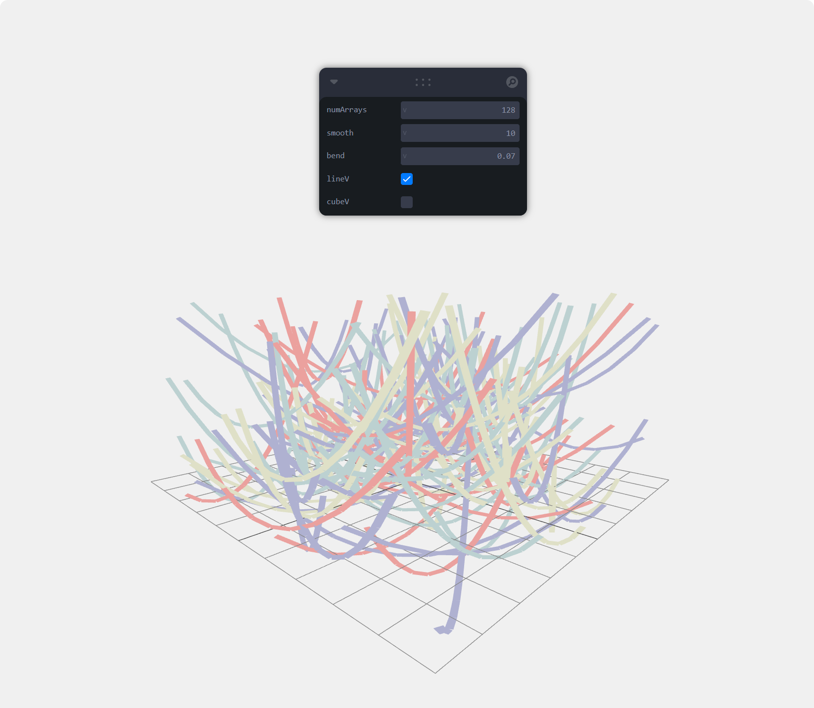
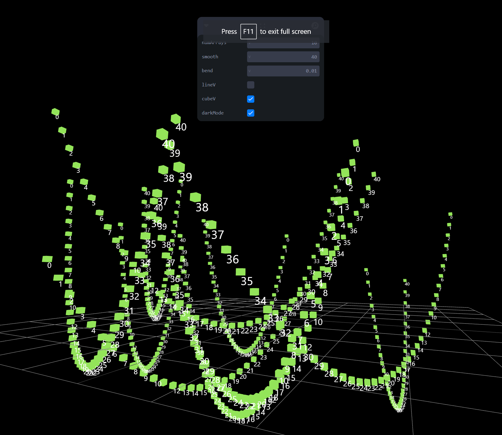

<br/>
<p align="center">
  <h3 align="center"> strings-that-hang</h3>

  <p align="center">
    react three fiber stringy strings
    <br/>
    <br/>
  </p>
</p>


## About The Project





This is a web application called "Strings That Hang" built with React and Three.js. It allows users to create and manipulate dynamic strings in a 3D environment, providing a unique interactive experience.


## Built With

* [React](https://reactjs.org/)
* [Three.js](https://threejs.org/)
* [GSAP](https://greensock.com/gsap/)
* [Leva](https://leva.netlify.app/)
* [Meshline](https://github.com/supereggbert/meshline)


## Getting Started

To get started with this project, you will need to have Node.js and npm installed on your computer. Once installed, you can clone the project repository and run npm install to install the required dependencies. After that, you can run npm start to start the development server and view the project in your web browser.


### Prerequisites

You will need to have Node.js and npm installed on your computer to run this project.


### Installation

To install the project dependencies, run npm install in your terminal after cloning the project repository.

```sh
npm install
```


## Usage

To use this web application, simply open it in your web browser after running npm start in the project directory. You can create and manipulate strings in a 3D environment using the provided tools and controls.


```sh
npm start
```

